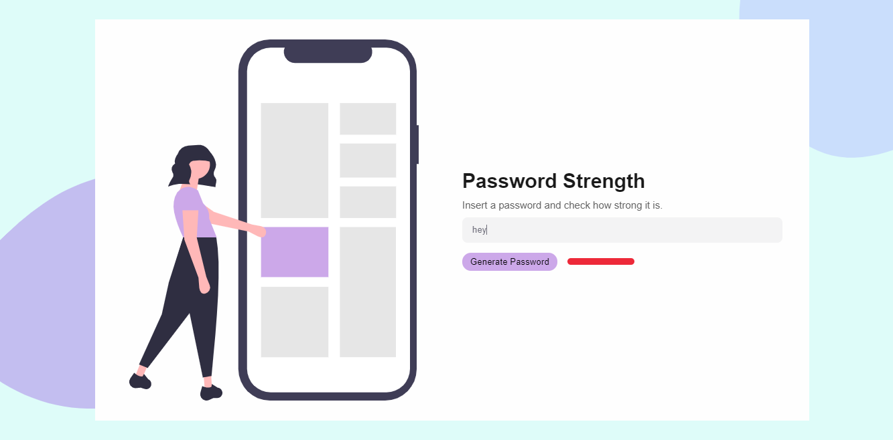

# Electron-Password-Safety

>  A desktop app made using electron that measures password strength and generates passwords. It was made using Electron.

[](https://travis-ci.org/badges/badgerbadgerbadger) [](https://coveralls.io/r/badges/badgerbadgerbadger) [](http://badges.mit-license.org)

[]()

- Most people will glance at your `README`, *maybe* star it, and leave
- Ergo, people should understand instantly what your project is about based on your repo
---

## Installation

- To run this project you need node and npm installed in your machine. Check setup section of README to get started.

### Clone

- Clone this repo to your local machine using `https://github.com/edumigueis/Electron-Password-Safety.git`

### Setup

- In order to use this project, you have to install the dependencies stated in the package.json file:

> install this project or clone it. Then, install the dependencies and load the app:

```shell
npm install
npm start
```

---

## Contributing

> To get started you have to fork and clone the repository. Then, you can create pull requests.

### Step 1

- **Option 1**
    - 🍴 Fork this repo!

- **Option 2**
    - 👯 Clone this repo to your local machine using `https://github.com/edumigueis/Electron-Password-Safety.git`

### Step 2

- **Go coding yey!** 🔨🔨🔨

### Step 3

- 🔃 Create a new pull request using <a href="https://github.com/edumigueis/Electron-Password-Safety/compare" target="_blank">`https://github.com/edumigueis/Electron-Password-Safety/compare`</a>.

---

## License

[](http://badges.mit-license.org)

- **[MIT license](http://opensource.org/licenses/mit-license.php)**
- Copyright 2020 © Eduardo Migueis.